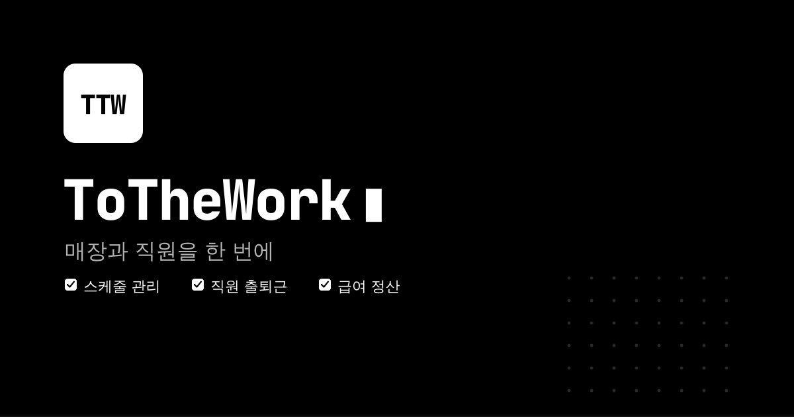
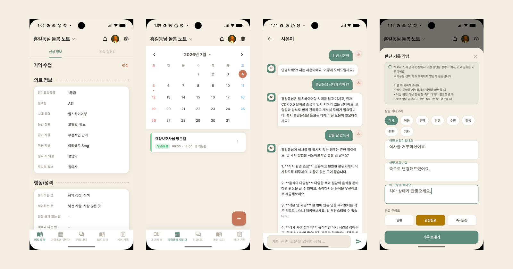

<div align="center">


# Hi, I'm DongHyun 👋

**Backend Developer · 개인 포트폴리오 사이트**

<br>


<br>

### [🔗 kiddo-dong.vercel.app](https://kiddo-dong.vercel.app)

[페이지 구성](#-페이지-구성) · [Featured Work](#-featured-work) · [기술 스택](#-기술-스택) · [프로젝트 구조](#-프로젝트-구조) · [로컬 실행](#-로컬-실행) · [Contact](#-contact)

</div>

---

## 📄 페이지 구성

한 페이지 스크롤로 구성된 포트폴리오입니다. 스크롤에 따라 섹션이 순서대로 등장합니다.

| 섹션 | 내용 |
|---|---|
| **Hero** | 타이핑 애니메이션 인사말과 프로필 일러스트 |
| **About.** | Backend · Database · Cloud & DevOps · API Design 역량과 보유 기술 |
| **Work.** | 대표 프로젝트 소개 · GitHub / Live Demo 링크 |
| **Contact.** | 이메일 · GitHub |

라이트 / 다크 테마를 지원하며 기본값은 다크 테마입니다.

---

## 🚀 Featured Work

<table>
<tr>
<td width="50%" valign="top">



### ToTheWork

자영업자를 위한 매장 및 인력 관리 서비스.
주휴·연장·야간·휴일 가산수당, 연소자 보호, 5인 미만 사업장 특례를 **스케줄을 짜는 시점에** 서버가 계산합니다.

`Spring Boot` `Spring AI` `MySQL` `pgvector`

[GitHub](https://github.com/kiddo-dong/tothework) · [tothework.com](https://tothework.com)

</td>
<td width="50%" valign="top">



### 실:온 (Sil:On)

치매 진단 전후 가족 보호자를 위한 재가 돌봄 정보·기록 플랫폼.
메모리북, 가족 돌봄 캘린더, 커뮤니티, AI 돌봄도감(시온이), 케어 기록을 제공합니다.

`Flutter` `Spring Boot` `Spring AI` `MySQL` `pgvector` `FCM` `AWS S3`

[Backend](https://github.com/kiddo-dong/Sil-On-BackEnd) · [Frontend](https://github.com/kiddo-dong/Sil-On-Flutter-Front-)

</td>
</tr>
</table>

---

## 🛠 기술 스택

| 분류 | 기술 |
|---|---|
| Framework | Next.js 15 (App Router, Turbopack) |
| UI | React 19, Tailwind CSS 4 |
| Animation | Motion (`motion/react`) |
| Icon | lucide-react |
| Language | TypeScript |
| Deploy | Vercel |

---

## 📁 프로젝트 구조

```
src/
├── app/
│   ├── layout.tsx          # 루트 레이아웃
│   ├── page.tsx            # 섹션 조합
│   └── globals.css         # 테마 토큰 · 전역 스타일
└── components/
    ├── Header.tsx          # 상단 네비게이션 · 테마 토글
    ├── HeroSection.tsx     # 인사말 타이핑 애니메이션
    ├── AboutSection.tsx    # 역량 · 기술 스택
    ├── WorkSection.tsx     # 프로젝트 목록
    ├── ContactFooter.tsx   # 연락처
    └── ThemeProvider.tsx   # 라이트 / 다크 테마
public/images/              # 프로필 · 프로젝트 이미지
```

> 프로젝트를 추가하거나 수정하려면 `src/components/WorkSection.tsx`의 `projects` 배열만 바꾸면 됩니다.
> `demo`를 `null`로 두면 Live Demo 버튼이 표시되지 않습니다.

---

## 💻 로컬 실행

```bash
npm install
npm run dev      # http://localhost:3000
```

| 명령어 | 설명 |
|---|---|
| `npm run dev` | 개발 서버 (Turbopack) |
| `npm run build` | 프로덕션 빌드 |
| `npm run start` | 빌드 결과 실행 |
| `npm run lint` | ESLint 검사 |

---

## 📬 Contact

<div align="center">

[](mailto:dh655933@gmail.com)
[](https://github.com/kiddo-dong)

</div>
